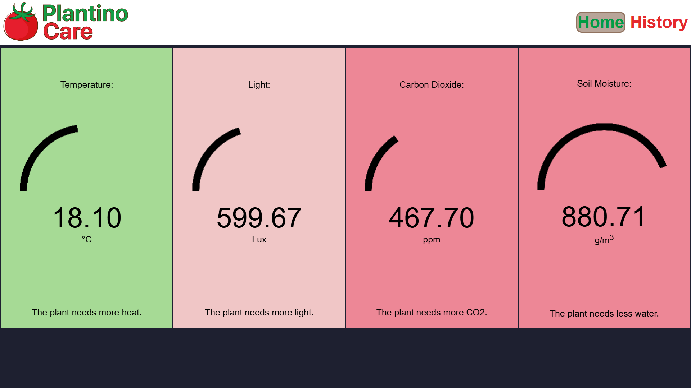
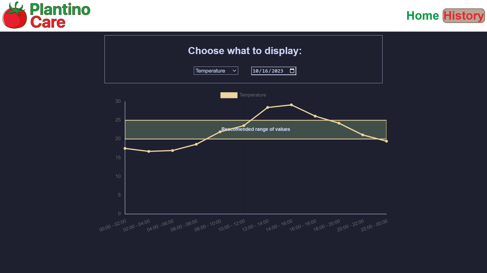
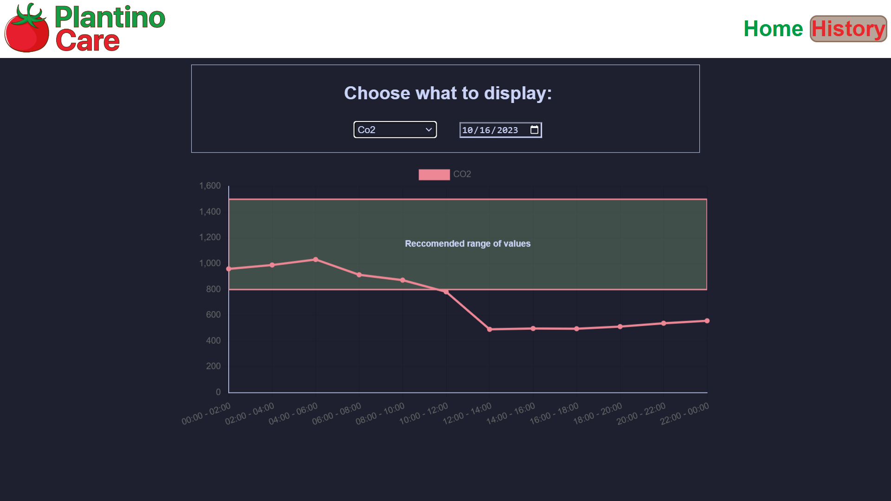
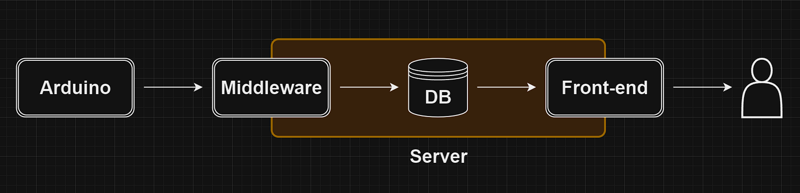

# PlantinoCare

---

Developed in occasion of the Arduino Day 2023, this project aims to assist in plant management while promoting water conservation, a critical issue in recent years.

---

### Overview:
This system utilizes a microcontroller and various sensors to collect data from the plant and its surrounding environment. A Python script processes the data and stores them in a MySQL database. The data are then accessed through a web application, which displays the information in a user-friendly interface that can be viewed on smartphones and computers. The application also provides helpful instructions for improving plant conditions.

Additionally, the system offers a second page that allows users to view past data in an intuitive graph format.

The system can also automate actions like watering and controlling light exposure.

This project was showcased at the 2023 "Rome Maker Faire" and was selected among competitors from across Europe.

---

## How It Works

The system is divided into four main components:

1. **Arduino Board**  
   The Arduino continuously reads data from the installed sensors, processes the information to make it readable with standard units of measurement, and sends the data to the serial port.

2. **Middleware**  
   A Python script listens to the serial port and inserts the data into a MySQL database. The script also logs the date and time of each reading. Every hour, it calculates average values from the data and stores them in a separate table called 'averages'. The 'datas' table is cleaned regularly to manage the large volume of data, as entries are recorded every 10 seconds.

3. **Database**  
   The system uses a MySQL database consisting of three tables: 'datas', 'averages', and 'info'. The 'info' table contains constant values for specific plants. For example, you can find the data for basil in the SQL code. A detailed database analysis is available in [this repository](https://github.com/mivige/PlantinoCare/blob/main/documentation/DB%20Analysis.md).

4. **Front-End**  
   The front-end is built primarily with HTML and JavaScript. The web page retrieves the latest data from the database and compares it with the plant's information from the 'info' table. Based on this comparison, it provides the user with care instructions. Additionally, users can visualize past data on a graph, selecting a date range.

### System Representation:

---
## Copyright

PlantinoCare © 2023 by Michele Vincenzo Gentile, Samuele Triveri is licensed under GPL-2.0 