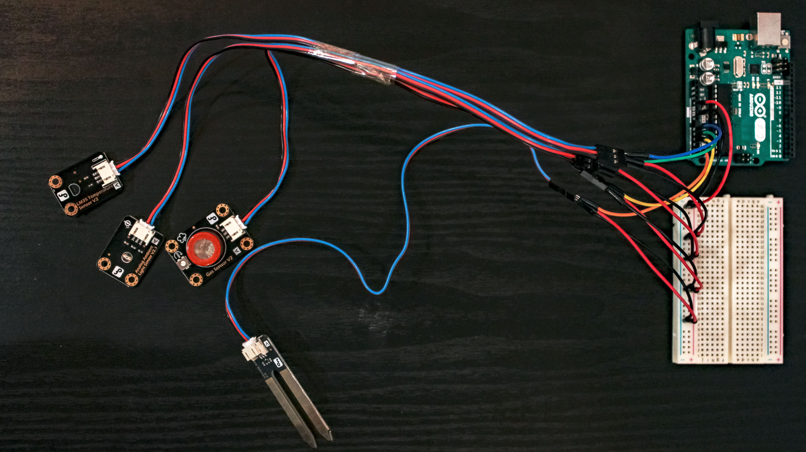

# PlantinoCare

---
Developed in occasion of the Arduino Day 2023, the project aims to assist in plant management while promoting water conservation, which has become crucial in recent years. 

Using a microcontroller and various sensors, we collect data from the plant and the surrounding environment, the data is read by a Python script that then writes them in a MySQL database.

A PHP web application then access and displays them in a user-friendly interface, accessible from smartphones and computers. This application provides instructions to improve plant conditions.

It is also possible to automate actions such as watering and control light exposure.

The project was presented during the 2023 edition of the "Rome Maker Faire", being chosen between competitors from all Europe.

---
## How it works

The whole project could be divided in 4 parts:

- Arduino board

  The code that runs continuously on the Arduino board reads the data from the installed sensors, process them to make them readable with common units of measure and then print them on the serial port.

- Middleware

  A Python script that is constantly running listens to the serial port and insert the datas in a MySQL database table called 'datas', adding the date and time of the reading. Every hour this same scripts copy the average values read in another table called 'averages' and clean the 'datas' table, this is to contain the enourmous quantity of data that we could get in a large time frame, knowing that we have a database entry every 10 seconds.

- Database
  
  The database runs on MySQL and is made of 3 tables: 'datas', 'averages' and 'info'. In the 'info' table there are constants values for specifics plants, in the SQL code you can see an example for a plant of basil. A deep-down database analysis is contained in <a href="https://github.com/mivige/PlantinoCare/blob/66d1d65ed66797f7bc709f22ad5ee403c37a6253/DB%20Analysis.md">this repository</a>.

- Front-end
  
  The front-end is made in PHP, the page access the database and read the last data inserted, then confront it with the 'info' table corresponding to the plant to display the correct instructions.

### Representation:

